# 风扇性能比较工具 - 优化实施路线图

## 一、系统架构优化

### 当前架构
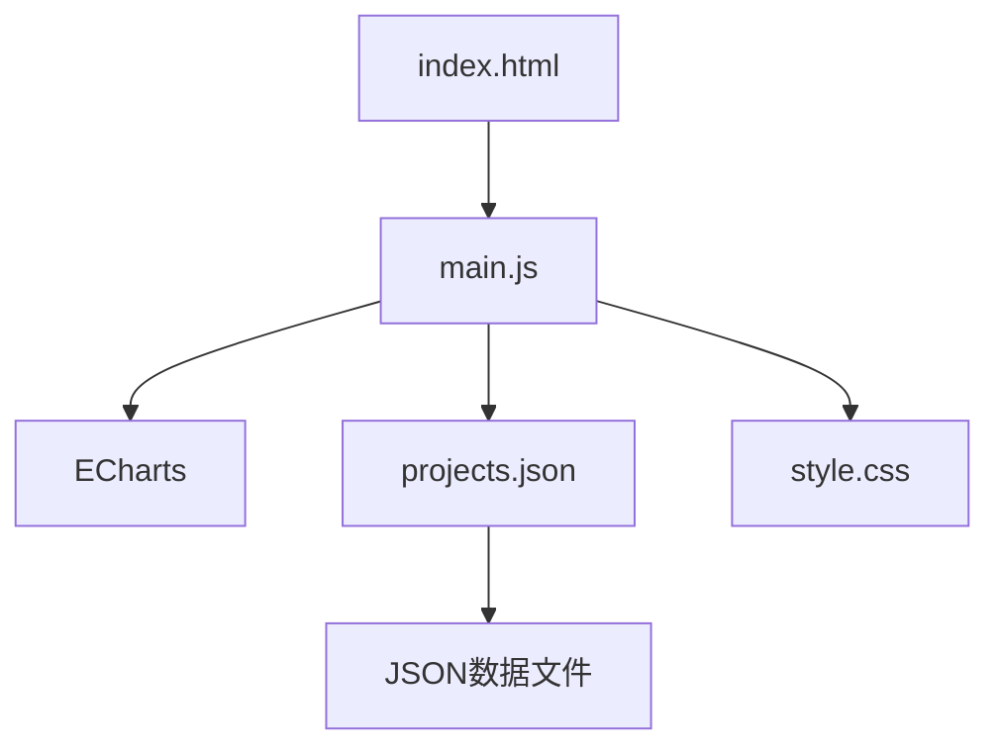

### 优化后架构
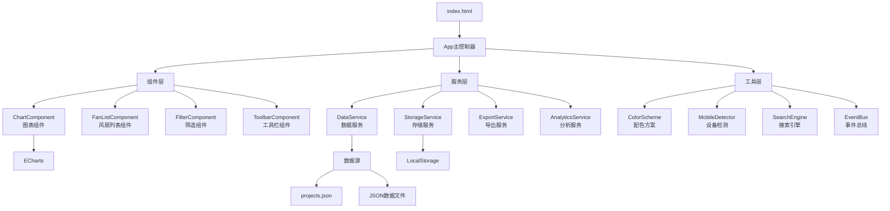

## 二、功能模块划分

### 核心模块
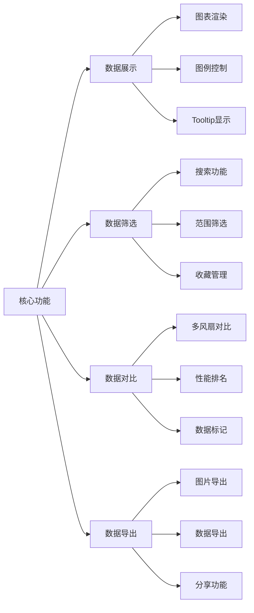

### 交互增强模块
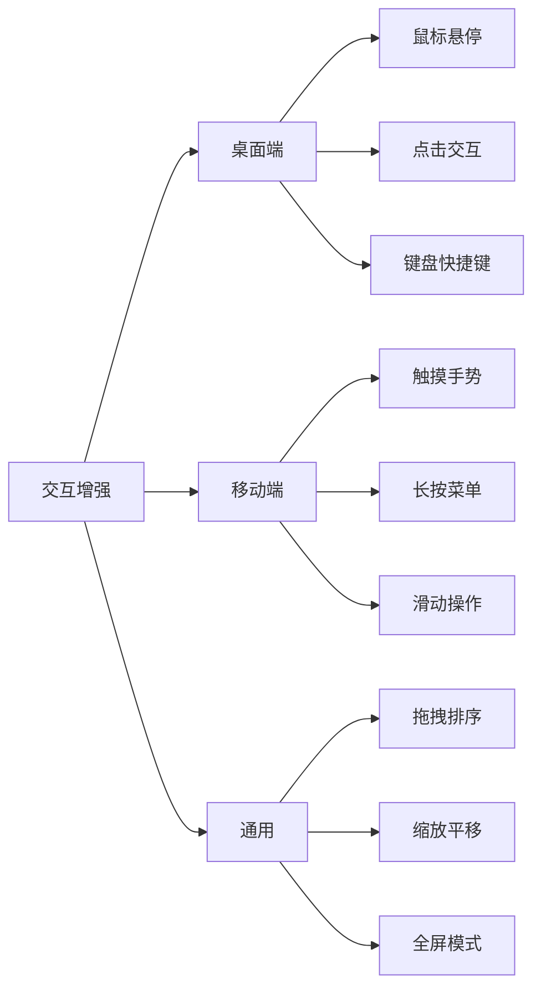

## 三、实施时间线

### 阶段一：基础优化（第1-2周）
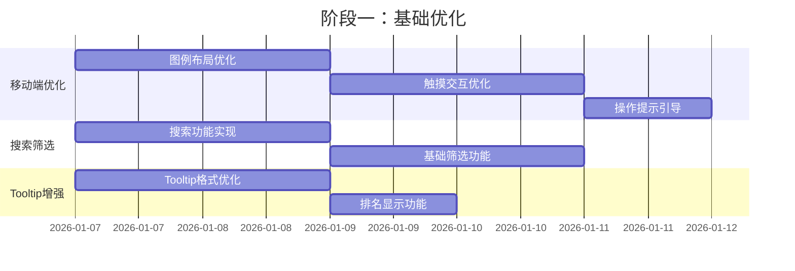

**主要任务**：
- ✅ 优化移动端图例布局
- ✅ 实现触摸交互优化
- ✅ 添加搜索功能
- ✅ 实现基础筛选
- ✅ 增强Tooltip显示

**交付成果**：
- 移动端体验显著改善
- 支持快速搜索和筛选
- 更丰富的数据展示

### 阶段二：功能增强（第3-5周）
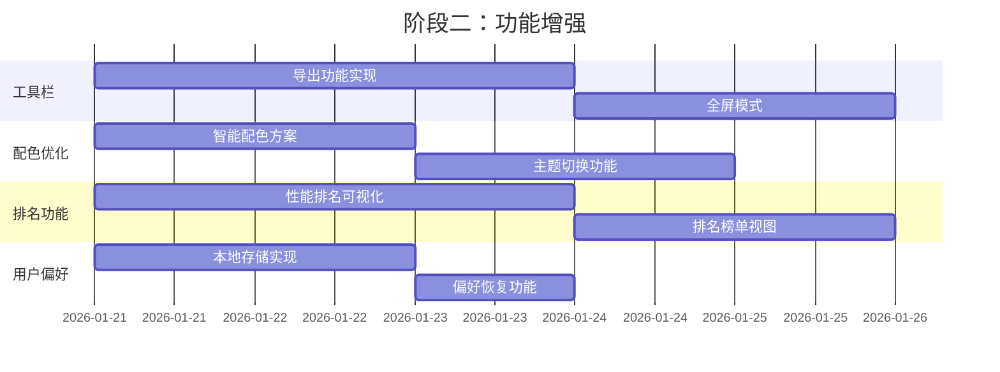

**主要任务**：
- ✅ 实现图表导出功能
- ✅ 添加智能配色方案
- ✅ 实现性能排名可视化
- ✅ 添加用户偏好保存
- ✅ 实现移动端操作提示

**交付成果**：
- 完整的导出功能
- 更好的视觉体验
- 个性化设置支持

### 阶段三：体验提升（第6-7周）
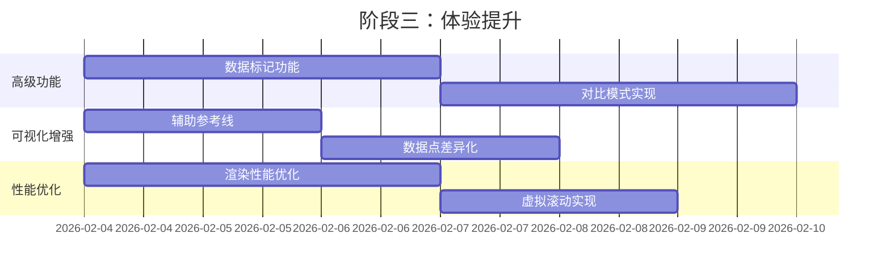

**主要任务**：
- ✅ 实现数据标记功能
- ✅ 添加对比模式
- ✅ 增强可视化效果
- ✅ 优化渲染性能

**交付成果**：
- 专业的数据分析工具
- 流畅的使用体验
- 完善的功能体系

## 四、优化项目详细规划

### 高优先级项目

#### 1. 图例优化（3天）
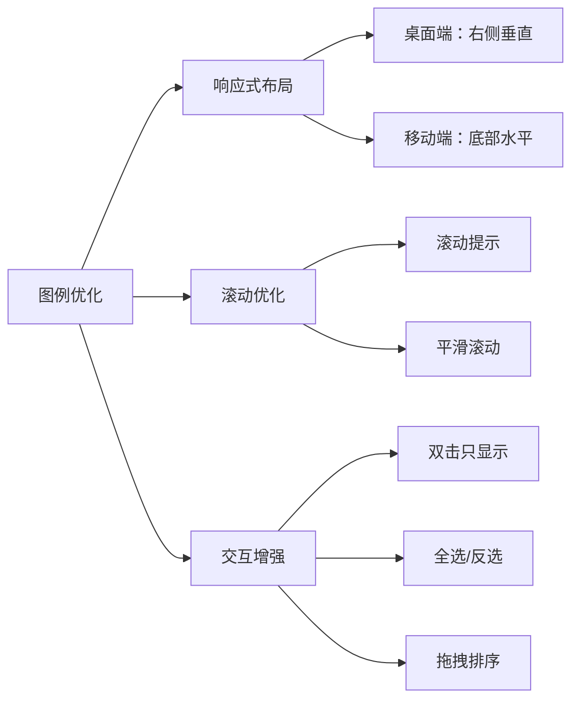

**实施步骤**：
1. 修改图例配置，支持响应式布局
2. 添加滚动提示和平滑滚动
3. 实现双击只显示功能
4. 添加全选/反选按钮
5. 实现拖拽排序（可选）

#### 2. 高级筛选功能（4天）
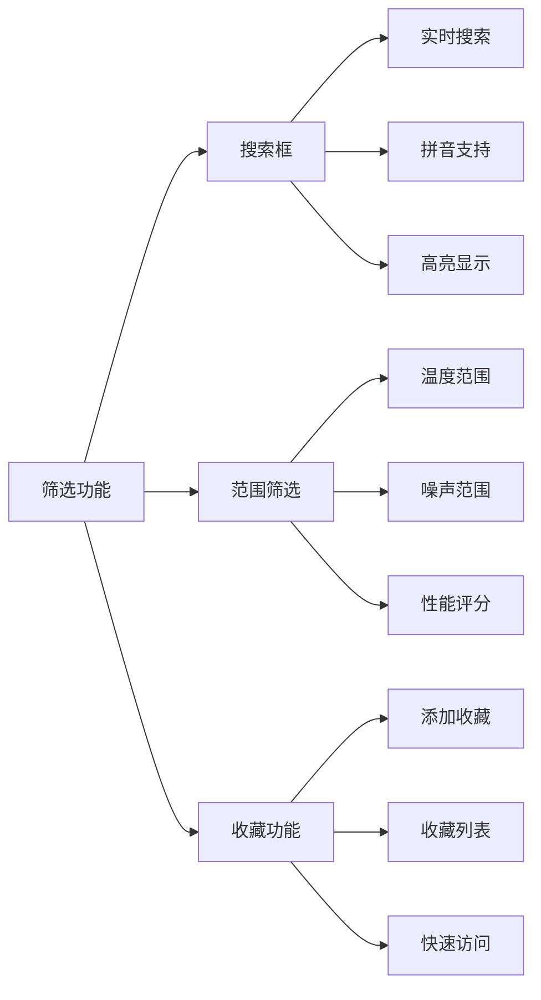

**实施步骤**：
1. 添加搜索框UI
2. 实现实时搜索逻辑
3. 添加范围筛选滑块
4. 实现收藏功能
5. 整合筛选逻辑

#### 3. 快速搜索功能（2天）
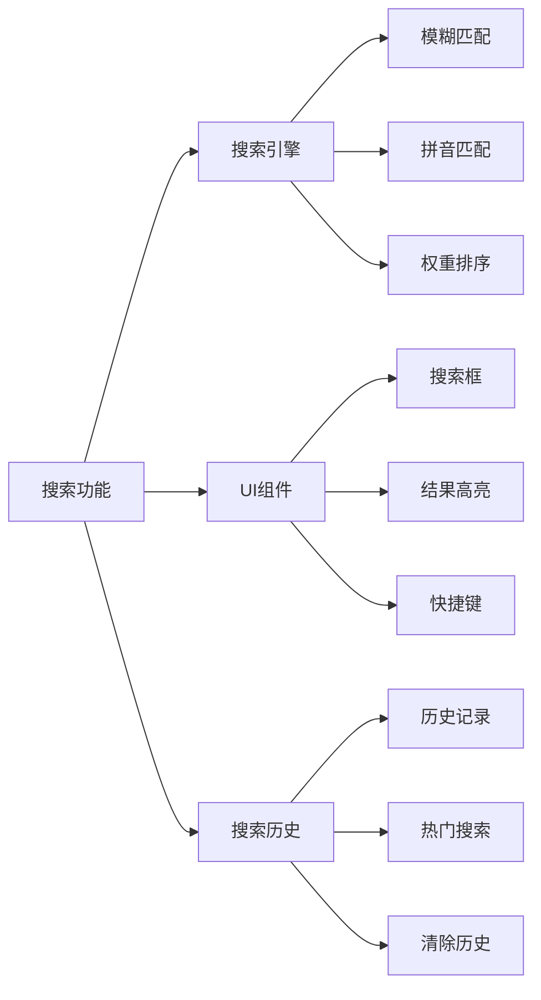

**实施步骤**：
1. 引入Fuse.js或实现简单搜索引擎
2. 添加搜索框UI
3. 实现搜索逻辑和高亮
4. 添加搜索历史功能
5. 实现键盘快捷键（Ctrl+F）

#### 4. 触摸交互优化（3天）
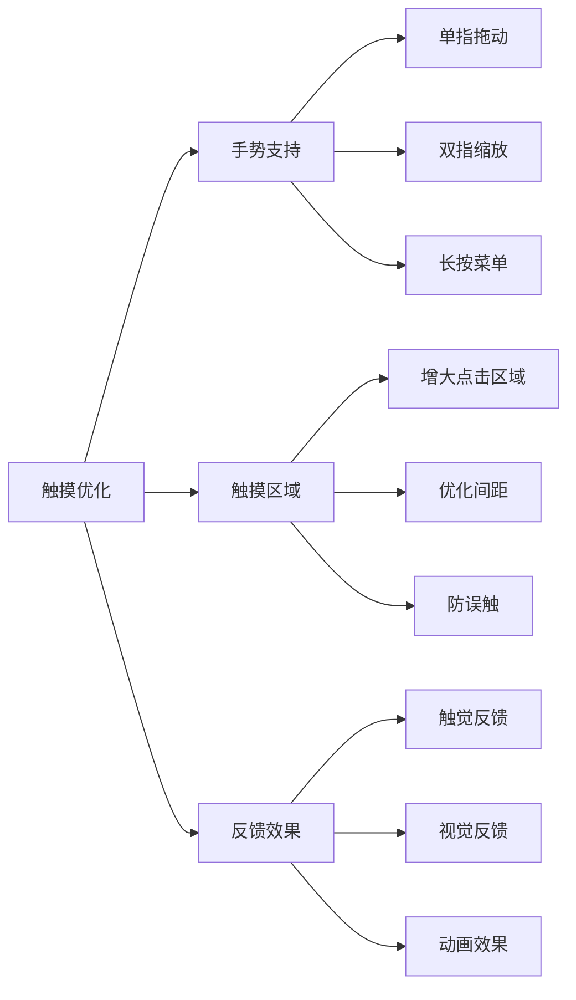

**实施步骤**：
1. 引入Hammer.js或使用原生Touch API
2. 实现手势识别
3. 优化触摸区域大小
4. 添加触觉和视觉反馈
5. 移动端专项测试

#### 5. 增强Tooltip显示（2天）
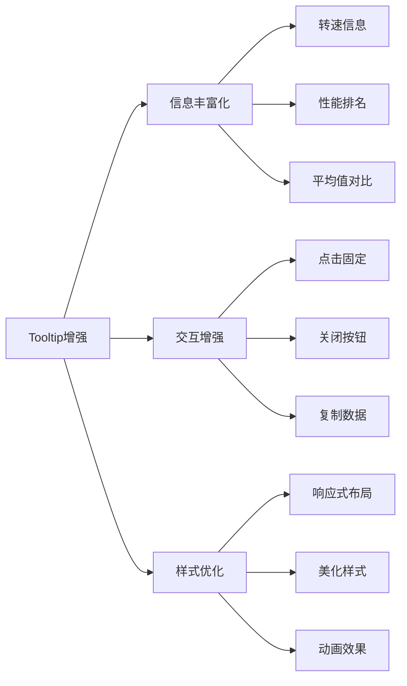

**实施步骤**：
1. 修改tooltip formatter
2. 添加排名计算逻辑
3. 实现点击固定功能
4. 优化tooltip样式
5. 添加复制数据功能

### 中优先级项目

#### 6. 图表工具栏增强（3天）
**功能清单**：
- 图片导出（PNG、SVG）
- 数据导出（CSV、Excel）
- 全屏模式
- 重置缩放
- 截图分享

#### 7. 智能配色方案（2天）
**功能清单**：
- 色盲友好配色
- 性能渐变配色
- 主题切换
- 自定义配色

#### 8. 性能排名可视化（3天）
**功能清单**：
- 排名榜单视图
- 按噪声水平筛选
- 排名动画
- 导出排名

#### 9. 用户偏好保存（2天）
**功能清单**：
- 保存选择状态
- 保存收藏列表
- 保存主题偏好
- 自动恢复

#### 10. 移动端操作提示（1天）
**功能清单**：
- 首次访问引导
- 手势图标提示
- 浮动操作按钮
- 帮助文档

## 五、技术实施细节

### 代码重构建议

#### 1. 模块化改造
```javascript
// 当前：所有代码在main.js中
// 优化后：按功能模块拆分

// app.js - 主应用
class FanComparisonApp {
    constructor() {
        this.chart = new ChartComponent();
        this.fanList = new FanListComponent();
        this.filter = new FilterComponent();
        this.toolbar = new ToolbarComponent();
        this.init();
    }
    
    init() {
        this.loadData();
        this.bindEvents();
        this.restorePreferences();
    }
}

// chartComponent.js - 图表组件
class ChartComponent {
    constructor(container) {
        this.container = container;
        this.chart = echarts.init(container);
        this.config = new ChartConfig();
    }
    
    render(data) {
        const option = this.config.getOption(data);
        this.chart.setOption(option);
    }
    
    export(format) {
        // 导出逻辑
    }
}

// fanListComponent.js - 风扇列表组件
class FanListComponent {
    constructor(container) {
        this.container = container;
        this.fans = [];
        this.selectedFans = new Set();
    }
    
    render(fans) {
        // 渲染逻辑
    }
    
    filter(criteria) {
        // 筛选逻辑
    }
}
```

#### 2. 事件系统
```javascript
// eventBus.js - 事件总线
class EventBus {
    constructor() {
        this.events = {};
    }
    
    on(event, callback) {
        if (!this.events[event]) {
            this.events[event] = [];
        }
        this.events[event].push(callback);
    }
    
    emit(event, data) {
        if (this.events[event]) {
            this.events[event].forEach(callback => callback(data));
        }
    }
}

// 使用示例
const eventBus = new EventBus();

// 组件A：发布事件
eventBus.emit('fanSelected', { fanName: 'AK700' });

// 组件B：订阅事件
eventBus.on('fanSelected', (data) => {
    console.log('Fan selected:', data.fanName);
});
```

#### 3. 数据服务
```javascript
// dataService.js - 数据服务
class DataService {
    constructor() {
        this.cache = new Map();
    }
    
    async loadProject(projectName) {
        if (this.cache.has(projectName)) {
            return this.cache.get(projectName);
        }
        
        const project = await this.fetchProject(projectName);
        this.cache.set(projectName, project);
        return project;
    }
    
    async fetchProject(projectName) {
        const response = await fetch(`json/${projectName}.json`);
        return await response.json();
    }
    
    calculateRanking(fans, noise) {
        // 排名计算逻辑
    }
    
    calculateAverage(fans) {
        // 平均值计算逻辑
    }
}
```

### 性能优化技术

#### 1. 虚拟滚动
```javascript
class VirtualScroll {
    constructor(container, items, itemHeight = 40) {
        this.container = container;
        this.items = items;
        this.itemHeight = itemHeight;
        this.visibleCount = Math.ceil(container.clientHeight / itemHeight) + 2;
        this.startIndex = 0;
        
        this.setupContainer();
        this.bindEvents();
        this.render();
    }
    
    setupContainer() {
        this.container.style.position = 'relative';
        this.container.style.overflow = 'auto';
        
        this.viewport = document.createElement('div');
        this.viewport.style.height = `${this.items.length * this.itemHeight}px`;
        this.container.appendChild(this.viewport);
        
        this.content = document.createElement('div');
        this.content.style.position = 'absolute';
        this.content.style.top = '0';
        this.content.style.width = '100%';
        this.viewport.appendChild(this.content);
    }
    
    bindEvents() {
        this.container.addEventListener('scroll', () => {
            this.render();
        });
    }
    
    render() {
        const scrollTop = this.container.scrollTop;
        this.startIndex = Math.floor(scrollTop / this.itemHeight);
        const endIndex = Math.min(
            this.startIndex + this.visibleCount,
            this.items.length
        );
        
        const visibleItems = this.items.slice(this.startIndex, endIndex);
        
        this.content.style.transform = `translateY(${this.startIndex * this.itemHeight}px)`;
        this.content.innerHTML = visibleItems
            .map((item, index) => this.renderItem(item, this.startIndex + index))
            .join('');
    }
    
    renderItem(item, index) {
        return `
            <div class="virtual-item" style="height: ${this.itemHeight}px">
                ${item.name}
            </div>
        `;
    }
}
```

#### 2. 防抖和节流
```javascript
// utils/performance.js
export function debounce(func, wait) {
    let timeout;
    return function executedFunction(...args) {
        const later = () => {
            clearTimeout(timeout);
            func(...args);
        };
        clearTimeout(timeout);
        timeout = setTimeout(later, wait);
    };
}

export function throttle(func, limit) {
    let inThrottle;
    return function(...args) {
        if (!inThrottle) {
            func.apply(this, args);
            inThrottle = true;
            setTimeout(() => inThrottle = false, limit);
        }
    };
}

// 使用示例
const debouncedSearch = debounce((term) => {
    performSearch(term);
}, 300);

const throttledScroll = throttle(() => {
    updateVisibleItems();
}, 100);
```

#### 3. 懒加载
```javascript
// 图片懒加载
class LazyLoader {
    constructor() {
        this.observer = new IntersectionObserver(
            (entries) => this.handleIntersection(entries),
            { rootMargin: '50px' }
        );
    }
    
    observe(elements) {
        elements.forEach(el => this.observer.observe(el));
    }
    
    handleIntersection(entries) {
        entries.forEach(entry => {
            if (entry.isIntersecting) {
                this.loadElement(entry.target);
                this.observer.unobserve(entry.target);
            }
        });
    }
    
    loadElement(element) {
        const src = element.dataset.src;
        if (src) {
            element.src = src;
        }
    }
}
```

## 六、质量保证

### 测试策略

#### 1. 单元测试
```javascript
// 使用Jest进行单元测试
describe('DataService', () => {
    test('should calculate ranking correctly', () => {
        const fans = [
            { name: 'Fan A', temp: 75 },
            { name: 'Fan B', temp: 80 },
            { name: 'Fan C', temp: 70 }
        ];
        const ranking = dataService.calculateRanking(fans);
        expect(ranking[0].name).toBe('Fan C');
    });
});
```

#### 2. 集成测试
```javascript
// 使用Cypress进行E2E测试
describe('Fan Comparison Tool', () => {
    it('should filter fans by search term', () => {
        cy.visit('/');
        cy.get('#fan-search').type('AK700');
        cy.get('#fan-list label:visible').should('have.length', 2);
    });
    
    it('should export chart as image', () => {
        cy.visit('/');
        cy.get('.export-button').click();
        cy.get('.export-png').click();
        // 验证下载
    });
});
```

#### 3. 性能测试
```javascript
// 使用Lighthouse进行性能测试
const lighthouse = require('lighthouse');
const chromeLauncher = require('chrome-launcher');

async function runLighthouse() {
    const chrome = await chromeLauncher.launch();
    const options = {
        port: chrome.port,
        onlyCategories: ['performance']
    };
    
    const runnerResult = await lighthouse('http://localhost:8080', options);
    const score = runnerResult.lhr.categories.performance.score * 100;
    console.log('Performance score:', score);
    
    await chrome.kill();
}
```

### 代码质量

#### 1. ESLint配置
```javascript
// .eslintrc.js
module.exports = {
    env: {
        browser: true,
        es2021: true
    },
    extends: 'eslint:recommended',
    parserOptions: {
        ecmaVersion: 12,
        sourceType: 'module'
    },
    rules: {
        'indent': ['error', 4],
        'quotes': ['error', 'single'],
        'semi': ['error', 'always'],
        'no-unused-vars': 'warn',
        'no-console': 'warn'
    }
};
```

#### 2. 代码审查清单
- [ ] 代码符合ESLint规范
- [ ] 所有函数都有注释
- [ ] 没有硬编码的魔法数字
- [ ] 错误处理完善
- [ ] 性能优化到位
- [ ] 移动端适配良好
- [ ] 无障碍性考虑
- [ ] 浏览器兼容性测试通过

## 七、部署和发布

### 发布流程
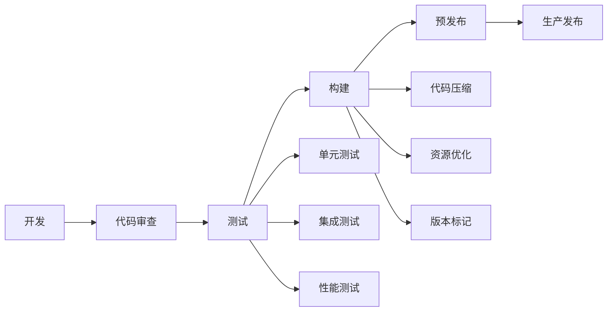

### 版本规划
- **v1.1.0**（阶段一）：基础优化
- **v1.2.0**（阶段二）：功能增强
- **v1.3.0**（阶段三）：体验提升
- **v2.0.0**（未来）：重大更新

## 八、风险评估

### 技术风险
| 风险 | 影响 | 概率 | 应对措施 |
|------|------|------|----------|
| 浏览器兼容性问题 | 高 | 中 | 充分测试，提供降级方案 |
| 性能问题 | 中 | 低 | 性能监控，及时优化 |
| 第三方库依赖 | 低 | 低 | 选择稳定的库，保持更新 |

### 项目风险
| 风险 | 影响 | 概率 | 应对措施 |
|------|------|------|----------|
| 时间延期 | 中 | 中 | 合理规划，预留缓冲 |
| 需求变更 | 中 | 中 | 敏捷开发，快速响应 |
| 资源不足 | 高 | 低 | 优先级管理，分阶段实施 |

## 九、成功指标

### 量化指标
- 移动端用户满意度提升 > 30%
- 搜索使用率 > 50%
- 导出功能使用率 > 20%
- 页面加载时间 < 2秒
- 首次交互时间 < 1秒
- Lighthouse性能分数 > 90

### 定性指标
- 用户反馈积极
- 操作流畅度提升
- 学习成本降低
- 功能完善度提高

## 十、总结

本实施路线图提供了详细的优化计划，包括：
- 清晰的架构设计
- 分阶段的实施计划
- 具体的技术方案
- 完善的质量保证
- 明确的成功指标

通过系统化的实施，可以显著提升工具的质量和用户体验。
